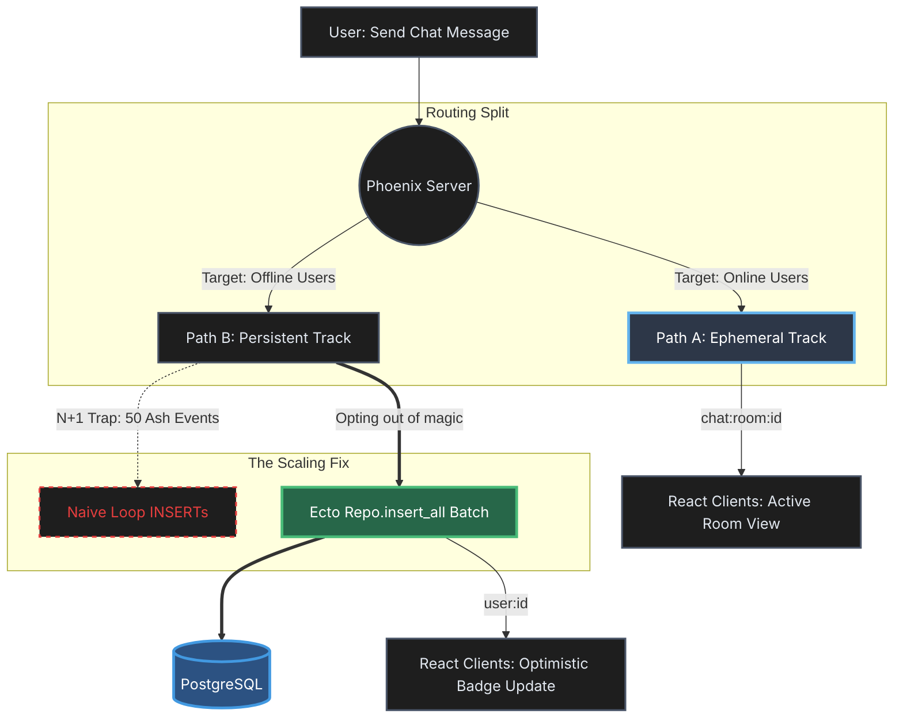

# Chat Architecture Scaling Diagram Implementation Plan

> **For Antigravity:** REQUIRED WORKFLOW: Use `.agent/workflows/execute-plan.md` to execute this plan in single-flow mode.

**Goal:** Create a visual infographic diagram (`chat-architecture-infographic.png`) that illustrates the scaling strategy described in `chat-architecture-scaling.md` and link it to the article.

**Architecture:** Use Mermaid.js to generate a scalable flowchart that accurately represents the "Option 3" End-to-End Chat Lifecycle described in the design document (`docs/plans/2026-03-06-chat-architecture-diagram-design.md`). The diagram will be exported to PNG and placed in the project's public directory.

**Tech Stack:** Mermaid CLI (`mmdc`), Markdown.

---

### Task 1: Initialize the Mermaid Diagram Source File

**Files:**
- Create: `docs/assets/diagrams/chat-architecture-infographic.mmd`

**Step 1: Write the failing test**
Run: `ls docs/assets/diagrams/chat-architecture-infographic.mmd`
Expected: FAIL (No such file or directory)

**Step 2: Write minimal implementation**
Create the file with the base Mermaid graph structure (Option 3 Design):



**Step 3: Run test to verify it passes**
Run: `cat docs/assets/diagrams/chat-architecture-infographic.mmd`
Expected: PASS (File contains mermaid definition)

**Step 4: Commit**
```bash
git add docs/assets/diagrams/chat-architecture-infographic.mmd
git commit -m "docs(chat): create mermaid source for architecture diagram"
```

### Task 2: Generate the PNG Infographic

**Files:**
- Create: `public/projects/lms-sertifikasi/chat-architecture-infographic.png`

**Step 1: Write the failing test**
Run: `ls public/projects/lms-sertifikasi/chat-architecture-infographic.png`
Expected: FAIL (No such file or directory)

**Step 2: Write minimal implementation**
Use Mermaid CLI (via npx) to generate the diagram.
Note: Ensure we use a dark theme to match the project aesthetics.

Run command:
```bash
npx -p @mermaid-js/mermaid-cli mmdc -i docs/assets/diagrams/chat-architecture-infographic.mmd -o public/projects/lms-sertifikasi/chat-architecture-infographic.png -t dark -b transparent
```

**Step 3: Run test to verify it passes**
Run: `ls -la public/projects/lms-sertifikasi/chat-architecture-infographic.png`
Expected: PASS (File exists with size > 0)

**Step 4: Commit**
```bash
git add public/projects/lms-sertifikasi/chat-architecture-infographic.png
git commit -m "docs(chat): generate chat architecture infographic png"
```

### Task 3: Link the Infographic in the Markdown Article

**Files:**
- Modify: `content/projects/lms-sertifikasi/chat-architecture-scaling.md`

**Step 1: Write the failing test**
Run: `grep "chat-architecture-infographic.png" content/projects/lms-sertifikasi/chat-architecture-scaling.md`
Expected: FAIL (or verify it exists but points correctly)
*Note: The article currently has `` on line 12. We just need to ensure the path is correct and matches our generated file.*

**Step 2: Write minimal implementation**
Since the markdown file already includes the reference on line 12: ``, and we generated the file at `public/projects/lms-sertifikasi/chat-architecture-infographic.png`, the Nuxt Content image resolution should work perfectly (public directory files are served at the root).

No file modifications are strictly required if it matches perfectly, but we will run a quick verification. If it doesn't match perfectly, we update line 12. 
(Self-correction: The path in the markdown `` maps to `public/projects/...` in Nuxt. So no changes needed to the `.md` file, just verification).

**Step 3: Commit**
No commit needed if the markdown file was already correct.

### Task 4: Complete and Verify

**Goal:** Ensure the diagram looks correct and the article references it properly.

**Step 1: Verify the image generated successfully**
Run: `file public/projects/lms-sertifikasi/chat-architecture-infographic.png`
Expected: `PNG image data...`

**Step 2: Update Task Tracker**
Update `docs/plans/task.md` to reflect completion of the flowchart generation.
